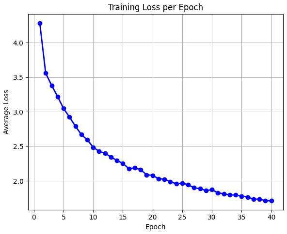
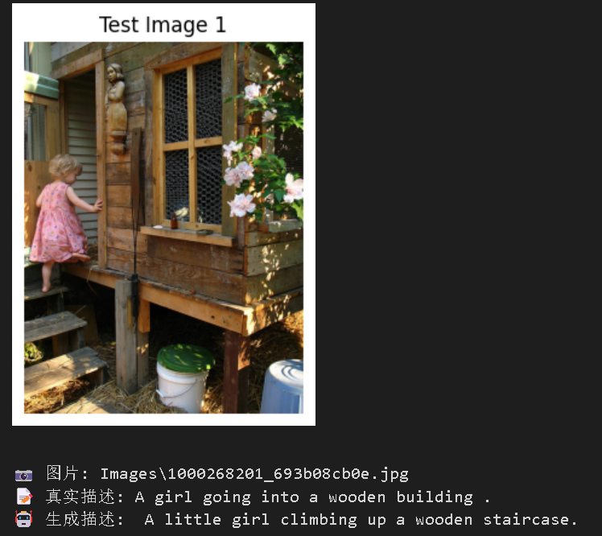
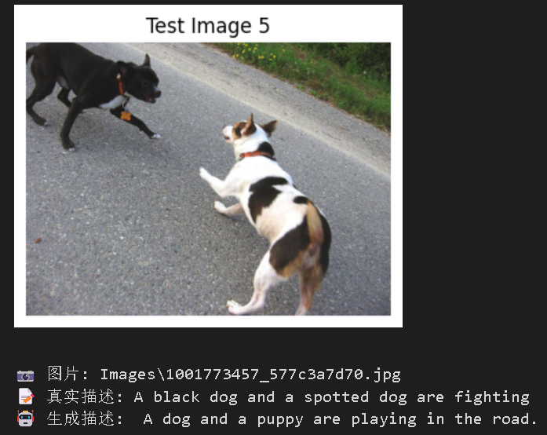
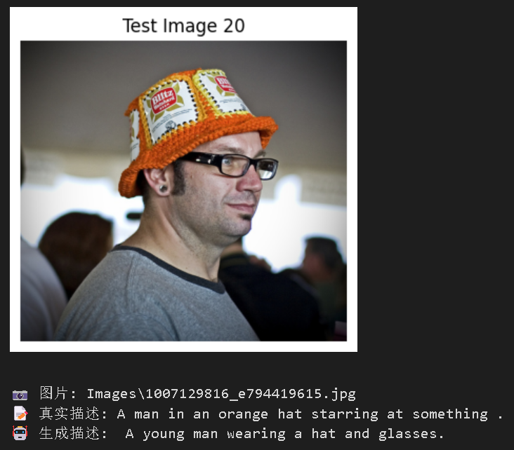
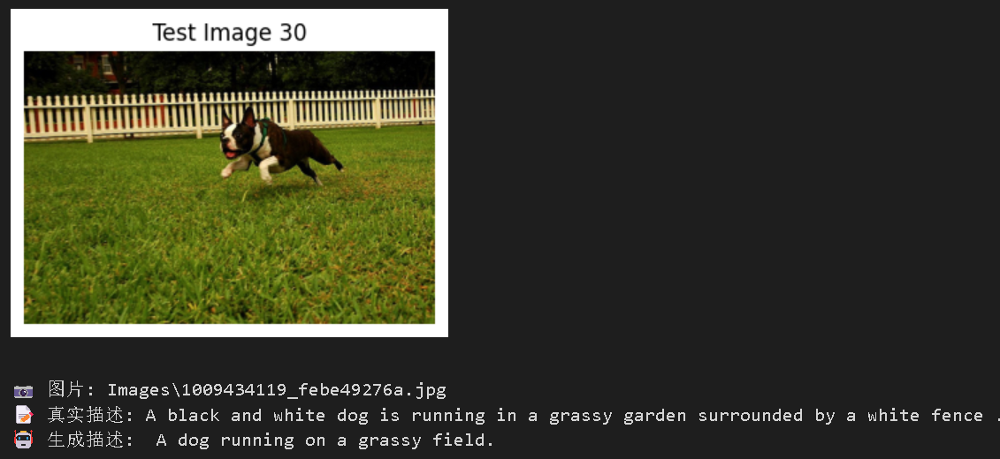
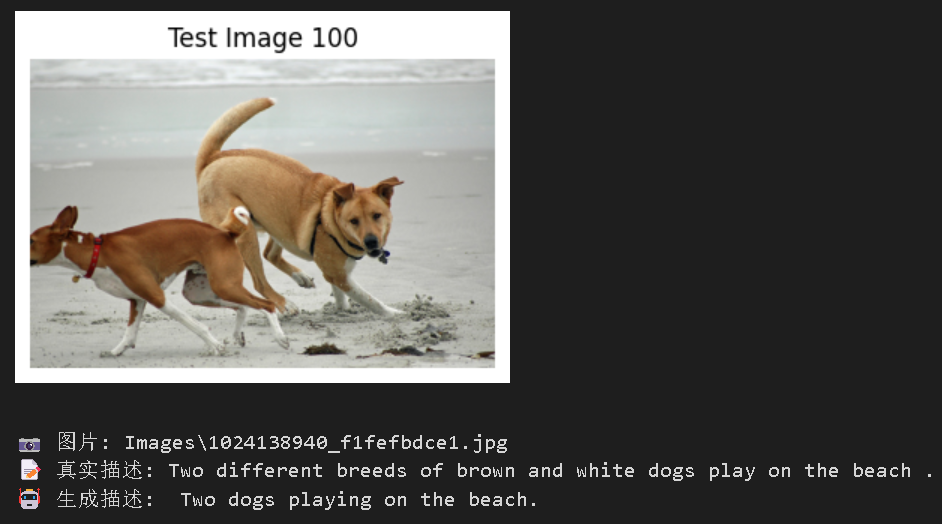
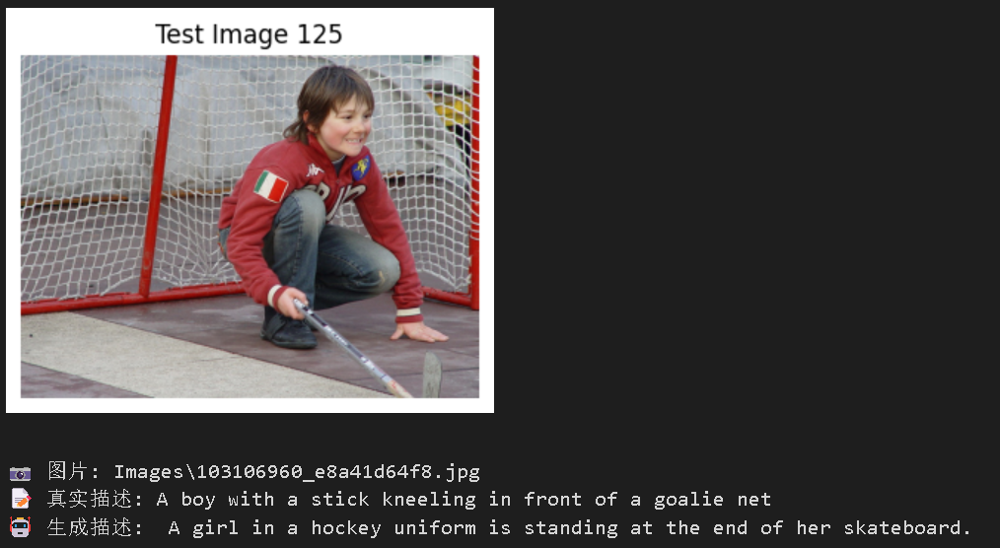
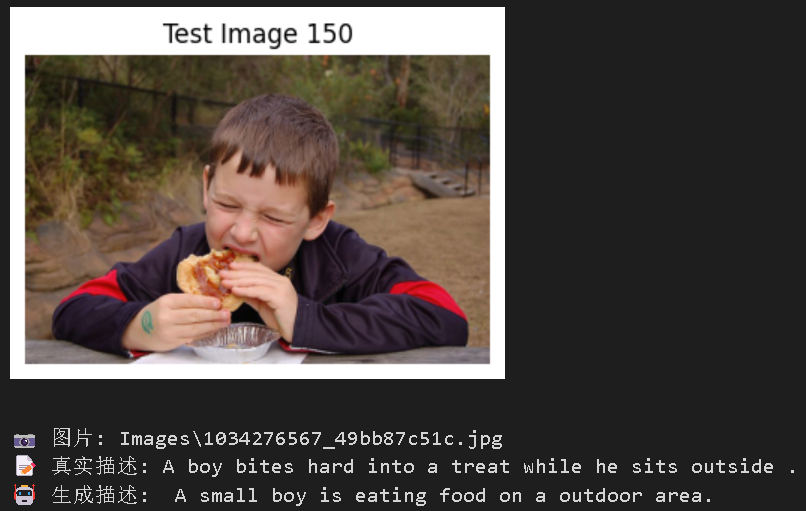
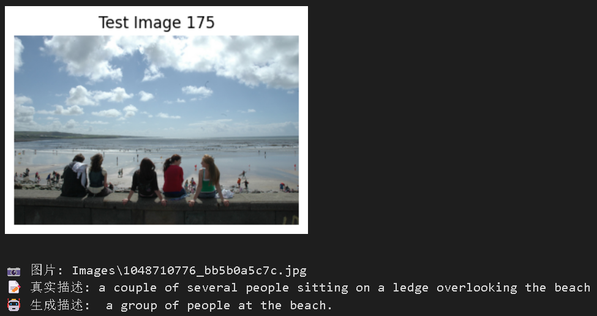
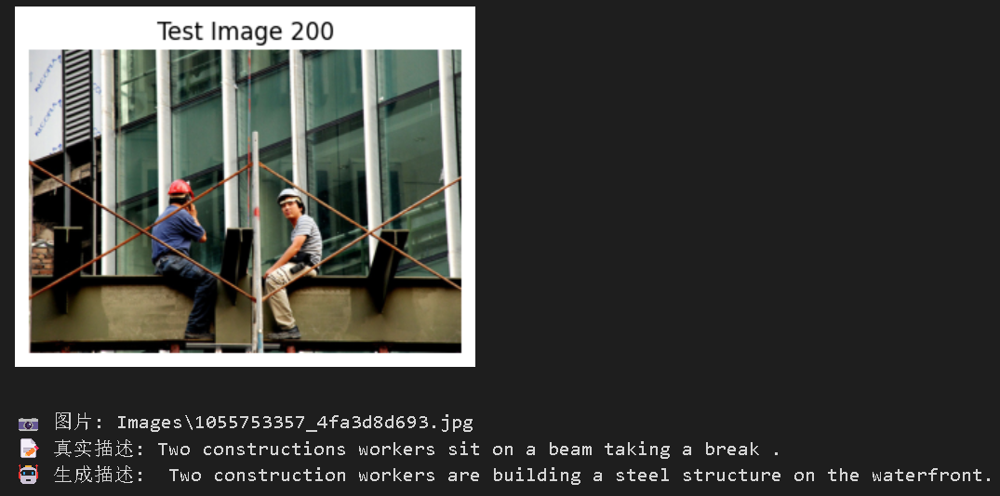

# Mini-BLIP2 图像描述生成复现实验报告

## 1. 论文信息

- 论文名称：BLIP-2: Bootstrapping Language-Image Pre-training with Frozen Image Encoders and Large Language Models
- 论文地址：https://arxiv.org/abs/2301.12597

## 2. 任务说明

本实验复现的任务是图像描述生成 Image Captioning。

输入：图片  
输出：英文 caption

## 3. 数据集

- 数据集名称：Flickr8k
- 数据集地址：https://www.kaggle.com/datasets/adityajn105/flickr8k
- 实际使用数据量：前 500 张图片

## 4. 模型结构

请说明自己的 Mini-BLIP2 结构，例如：

Image → Frozen CLIP Vision Encoder → Mini Q-Former → Linear Projection → Frozen OPT Language Decoder → Caption

### 4.1 Vision Encoder

填写使用的视觉编码器，CLIP Vision Encoder (clip-vit-base-patch32)

### 4.2 Mini Q-Former

说明自己实现的 Mini Q-Former：

- query token 数量：8
- hidden size：512
- Transformer 层数：2
- 是否使用 cross-attention：否

### 4.3 Language Decoder

填写使用的语言解码器，OPT (Open Pre-trained Transformer)

## 5. 训练设置

请填写：

- 训练数据量：500
- epoch：50
- batch size：4
- learning rate：1e-4
- optimizer：Adam
- loss function：CrossEntropyLoss
- 冻结的模块：CLIP Vision Encoder、OPT Language Decoder
- 训练的模块：Mini Q-Former、Linear Projection Layer

## 6. 训练过程

粘贴训练日志或 loss 变化截图。
40轮的重新打开后找不到了只有30轮的：
- Epoch 1/30 Loss: 4.1819
- Epoch 2/30 Loss: 3.5065
- Epoch 3/30 Loss: 3.3511
- Epoch 4/30 Loss: 3.1892
- Epoch 5/30 Loss: 3.0517
- Epoch 6/30 Loss: 2.8929
- Epoch 7/30 Loss: 2.7708
- Epoch 8/30 Loss: 2.6749
- Epoch 9/30 Loss: 2.5839
- Epoch 10/30 Loss: 2.5116
- Epoch 11/30 Loss: 2.4533
- Epoch 12/30 Loss: 2.3879
- Epoch 13/30 Loss: 2.3242
- Epoch 14/30 Loss: 2.2689
- Epoch 15/30 Loss: 2.2357
- Epoch 16/30 Loss: 2.2071
- Epoch 17/30 Loss: 2.1561
- Epoch 18/30 Loss: 2.1417
- Epoch 19/30 Loss: 2.0793
- Epoch 20/30 Loss: 2.0523
- Epoch 21/30 Loss: 2.0356
- Epoch 22/30 Loss: 1.9976
- Epoch 23/30 Loss: 1.9741
- Epoch 24/30 Loss: 1.9311
- Epoch 25/30 Loss: 1.9230
- Epoch 26/30 Loss: 1.9034
- Epoch 27/30 Loss: 1.8798
- Epoch 28/30 Loss: 1.8580
- Epoch 29/30 Loss: 1.8452
- Epoch 30/30 Loss: 1.8194


   ### - 40轮训练loss曲线：

    
   

    

## 7. 生成结果展示

至少展示 3—5 个例子。

| 图片编号 | 真实 Caption | 模型生成 Caption |
|:----:|:----:|:----:|
| 1 |A girl going into a wooden building.   |A little girl climbing up a wooden staircase.  |
| 5 |A black dog and a spotted dog are fighting.    | A dog and a puppy are playing in the road. |
| 20 |A man in an orange hat starring at something .  |A man wearing glasses and a hat is sitting on the front of a building.    |
| 30 |A black and white dog is running in a grassy garden surrounded by a white fence.  |A dog running on a grassy field.    |
| 100 |Two different breeds of brown and white dogs play on the beach .  |Two dogs playing on the beach.    |
| 125 |A boy with a stick kneeling in front of a goalie net.  |A girl in a hockey uniform is standing at the end of her skateboard.    |
| 150 |A boy bites hard into a treat while he sits outside.  |A small boy is eating food on a outdoor area.    |
| 175 |a couple of several people sitting on a ledge overlooking the beach.  |a group of people at the beach.    |
| 200 |Two constructions workers sit on a beam taking a break.  |Two construction workers are building a steel structure on the waterfront.    |


 
<div style="display: flex; gap: 10px;">
  
  
</div>

<div style="display: flex; gap: 0px;">
  
  
</div>

<div style="display: flex; gap: 0px;">
  
  
</div>

<div style="display: flex; gap: 0px;">
  
  
</div>



## 8. 总结

请简要说明：

- 是否成功跑通训练；

        成功加载了 CLIP、OPT 模型

        完成了 40 个 epoch 的训练

        Loss 从 4.1819 下降到 1.8194，稳定收敛

        模型 checkpoint 正常保存
- 生成效果如何；

        优点：能够生成与图片相关的描述（如识别出 "dogs playing on the beach"、"hockey uniform" 等关键词）

        缺点：不够准确：将 "boy with a stick kneeling in front of a goalie net" 生成成 "girl in a hockey uniform... skateboard"
- 遇到了什么问题；

        数据量不足	仅使用 500 条数据，泛化能力差

        Q-Former 设计简化	仅使用 self-attention，无 cross-attention，视觉-文本对齐弱

        生成重复/乱码	需要后处理清理（代码已加入清理函数）

        训练不稳定	Loss 下降但生成质量未同步提升
- 如果继续改进，可以怎么做。

        Q-Former 升级	改用 Transformer Decoder + Cross-Attention（对齐 BLIP-2 原始设计）
        
        增大 Query 数量	从 8 增加到 32 或 64
        
        增加 Q-Former 层数	从 2 层增加到 4-6 层
        
        Projection 替换	改用 2 层 MLP + GELU
        
        解冻部分语言模型	微调 OPT 的最后几层

## 9. AI 对话过程记录

请填写本次复现过程中与 AI 工具的对话记录（对应 requirements.md 第 9.1 节）。

- 录制工具：例如 entir.io
- 对话链接：
            deepseek解决文字出现乱码问题  https://chat.deepseek.com/share/cxv8play6o0jyspp1m  
           模型构建    https://chat.deepseek.com/share/rfm3do70016f3cxn0n  
           ChatGPT解决文字出现乱码问题 https://chatgpt.com/share/6a147c0c-874c-83eb-a732-663723841a03
- 使用的 AI 模型：例如 deepseek / ChatGPT 
- 累计对话时长 / 会话数：deepseek累计49条，ChatGPT无法查看

简要说明 AI 在哪些环节给了帮助、哪些地方是自己独立完成或推翻了 AI 的建议（2—4 句话即可）：

```使用ai搭建环境下载数据集，构建基本的模型框架，进行训练参数调整。
   主要使用ai进行输出句子乱码问题的纠正。

   使用ChatGPT辅助排查 QFormer 输出、Attention Mask 和文本生成阶段的问题。
```

## 10. Git 提交记录

请填写本次复现的代码仓库与提交历史（对应 requirements.md 第 9.2 节）。

- 仓库地址：origin  https://github.com/zhx767/blip2-main.git (fetch)
    
    origin  https://github.com/zhx767/blip2-main.git (push)
- 总 commit 数：5

粘贴 `git log --oneline` 输出（或截图）：

```text
  60b15de (HEAD -> main, origin/main) 添加训练代码和报告图片
  1b65a4c 添加gitignore忽略大文件
  e412234 zhx
```
